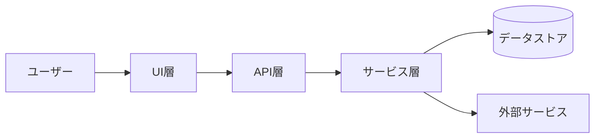
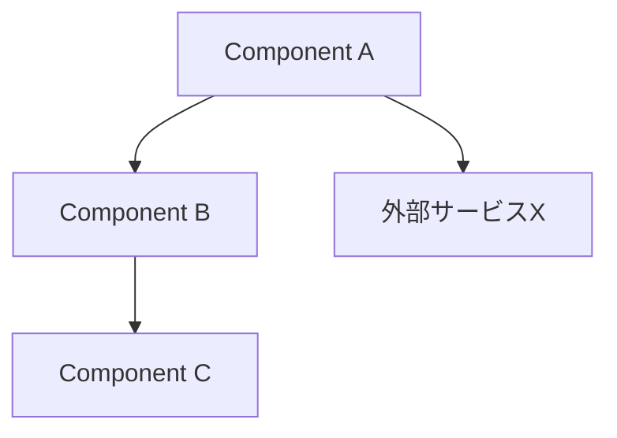
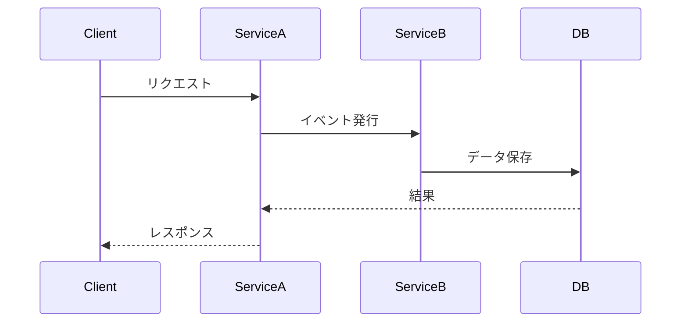
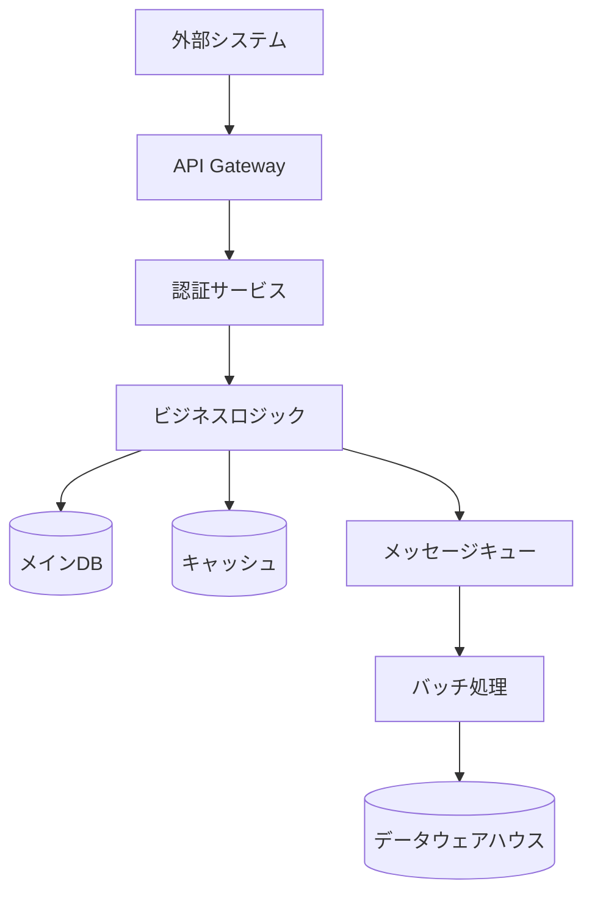
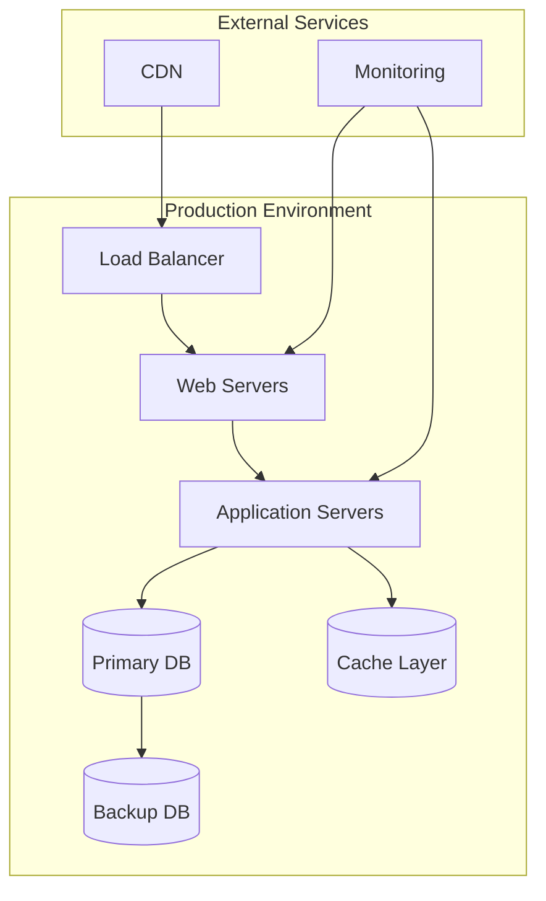
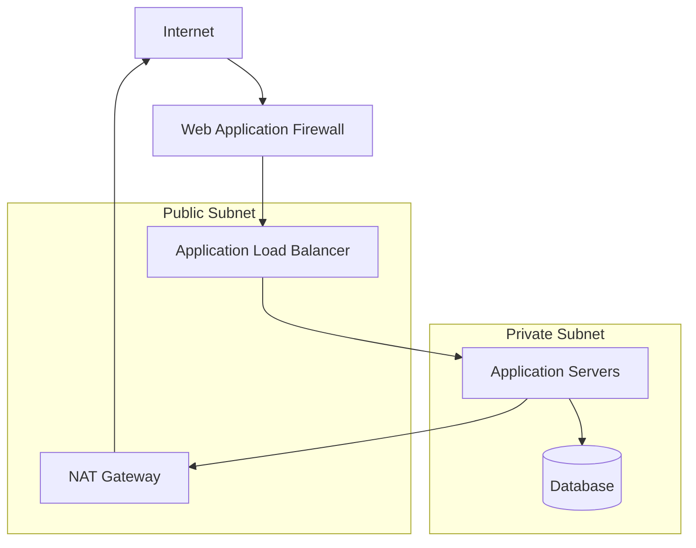
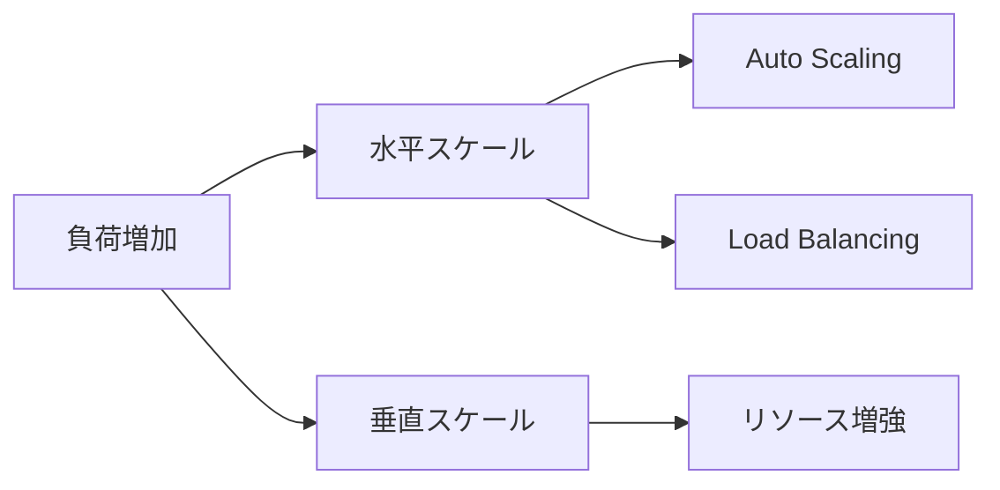
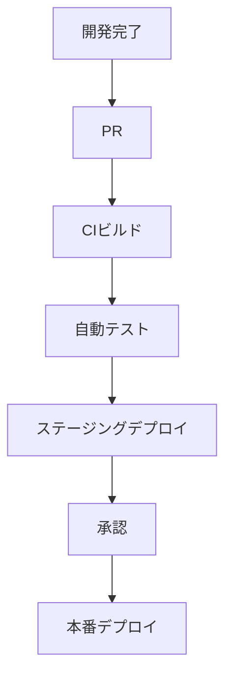

# アーキテクチャドキュメント テンプレート

**文書バージョン**: v1.0  
**作成日**: [作成日]  
**最終更新**: [更新日]  
**作成者**: [作成者名]

> **文書の位置付け**  
> - 本ドキュメントはシステム全体の構造・設計原則・技術選定理由など「なぜこの形になっているか」を示します。  
> - ADR（Architecture Decision Record）は個別の意思決定履歴を残すものであり、Architecture.md は採択済みの決定を統合して「現時点の全体像」を提示する役割です。  
> - 仕様変更時は、まず内部仕様書を更新し、アーキテクチャに影響が出る場合はADRを発行・更新し、その結果を反映する形で本ドキュメントを改訂してください。詳細な手順は `adr_guideline.md` を参照。

---

## 📋 目次

1. [概要](#1-概要)
2. [要求整理](#2-要求整理)
3. [全体アーキテクチャ](#3-全体アーキテクチャ)
4. [コンポーネント詳細](#4-コンポーネント詳細)
5. [データ・イベントフロー](#5-データイベントフロー)
6. [インフラストラクチャ](#6-インフラストラクチャ)
7. [セキュリティとコンプライアンス](#7-セキュリティとコンプライアンス)
8. [品質属性対応](#8-品質属性対応)
9. [アーキテクチャ決定記録](#9-アーキテクチャ決定記録)
10. [テスト・検証戦略](#10-テスト検証戦略)
11. [デプロイ・運用設計](#11-デプロイ運用設計)
12. [今後の改善計画](#12-今後の改善計画)
13. [付録](#13-付録)

---

## 1. 概要

### 1.1 背景と目的
- [プロジェクトの背景]
- [アーキテクチャ文書の目的]

### 1.2 ステークホルダー

| 役割 | 名前/部署 | 関心事 |
|------|-----------|--------|
| [プロダクトオーナー] | [氏名] | [期待と懸念] |
| [アーキテクト] | [氏名] | [期待と懸念] |

### 1.3 スコープ
- **対象システム**: [対象範囲]
- **非対象**: [範囲外要素]

---

## 2. 要求整理

### 2.1 ビジネス要求
- [要求1]
- [要求2]

### 2.2 システム要求

| 種別 | 内容 | 優先度 | 備考 |
|------|------|--------|------|
| 機能 | [機能要求1] | [High/Medium/Low] | [備考] |
| 非機能 | [非機能要求1] | [High] | [備考] |

### 2.3 制約条件
- **技術制約**: [例: 既存クラウドサービス利用必須]
- **組織制約**: [例: チーム構成、スキルセット]
- **コスト制約**: [予算、ライセンス]

---

## 3. システム構成と設計思想

### 3.1 システムコンテキスト図



**設計意図**: 
- [なぜこの構成を選んだか]
- [どのような課題を解決するか]

### 3.2 全体システム構成図

```mermaid
[メインシステムの全体構成図]
```

**アーキテクチャ説明**:
- [各層・コンポーネント間の関係性]
- [データの流れと処理フロー]
- [主要な設計原則]

### 3.3 アーキテクチャスタイル

#### 採用パターン
- **パターン**: [例: イベント駆動アーキテクチャ / レイヤードアーキテクチャ]
- **採用理由**: 
  - [ビジネス要件との適合性]
  - [チーム体制・スキルとの整合性]
  - [将来の拡張性への配慮]

#### 技術選定の判断基準

| 選定項目 | 採用技術 | 選定理由 | 代替案との比較 |
|---------|---------|---------|---------------|
| [アプリケーション基盤] | [選定技術] | [なぜ選んだか] | [他の候補との違い] |
| [データストア] | [選定技術] | [なぜ選んだか] | [他の候補との違い] |
| [インフラ基盤] | [選定技術] | [なぜ選んだか] | [他の候補との違い] |

#### トレードオフと制約

**制約条件**:
- [コスト制約]: [具体的な制約と影響]
- [技術制約]: [既存システムとの統合要件]
- [組織制約]: [チーム構成、運用体制]

**設計上のトレードオフ**:
- [選択A vs 選択B]: [どちらを選び、なぜか]
- [パフォーマンス vs 保守性]: [どのようなバランスを取ったか]

---

## 4. システムコンポーネント設計

### 4.1 コンポーネント構成図



### 4.2 コンポーネント設計方針

| コンポーネント | 設計方針 | 責務境界 | 他システムとの関係 |
|----------------|----------|----------|-------------------|
| [Component A] | [なぜこの方針か] | [何を担当し、何を担当しないか] | [依存関係の理由] |
| [Component B] | [なぜこの方針か] | [何を担当し、何を担当しないか] | [依存関係の理由] |

### 4.3 モジュール境界の設計判断

#### サービス分割の基準
- **ビジネス境界**: [ドメイン駆動設計における境界設定]
- **技術境界**: [技術的制約による分割理由]
- **チーム境界**: [Conway's Lawを考慮した分割]

#### 統合vs分離の判断
- **統合を選んだ領域**: [統合理由と将来の分離可能性]
- **分離を選んだ領域**: [分離理由とオーバーヘッドの許容]

---

## 5. データフローと統合設計

### 5.1 データフロー全体図

#### エンドツーエンドデータフロー


#### システム間データフロー


#### データフローの設計判断
- **リアルタイム vs バッチ処理**: [どの処理をリアルタイムにし、どれをバッチにするかの判断]
- **データ変換箇所**: [どの段階でデータを変換・正規化するかの設計]
- **エラーハンドリング**: [データフロー中の例外処理・リトライ戦略]

### 5.2 データ統合戦略

#### 通信パターンの選択
- **同期通信を選んだ箇所**: [リアルタイム性が必要な理由]
- **非同期通信を選んだ箇所**: [疎結合にする理由、処理遅延の許容]
- **イベント駆動を選んだ箇所**: [拡張性・保守性の重視]

#### データ一貫性の方針
- **強一貫性が必要な領域**: [ACID特性が必要な理由]
- **結果整合性で十分な領域**: [分散システムでの可用性優先]
- **補償トランザクション**: [分散処理での整合性保証]

### 5.3 外部システム統合方針

#### 統合方式の判断
- **API統合**: [選択理由と利用場面]
- **メッセージング統合**: [選択理由と利用場面]  
- **ファイル統合**: [選択理由と利用場面]

#### 障害処理設計
- **サーキットブレーカー**: [外部システム障害への対処]
- **リトライ戦略**: [一時的障害への対応方針]
- **フォールバック**: [代替処理の設計判断]

---

## 6. インフラストラクチャアーキテクチャ

### 6.1 インフラ構成図



### 6.2 インフラ設計方針

#### クラウド vs オンプレミスの選択
- **選択**: [選択したインフラ形態]
- **選択理由**: 
  - [コスト面での判断]
  - [技術的制約・要求との適合]
  - [運用体制・スキルとの整合性]
- **トレードオフ**: [選択しなかった方式のメリット・デメリット]

#### 環境戦略

| 環境 | 用途・役割 | 構成方針 | 本番との差異 |
|------|-----------|---------|-------------|
| **Development** | [個人開発・単体テスト] | [軽量構成の理由] | [簡略化した要素] |
| **Staging** | [統合テスト・受入テスト] | [本番相当の理由] | [本番と同等にする理由] |
| **Production** | [本番サービス] | [高可用性・性能重視] | [- (基準環境)] |

### 6.3 ネットワークアーキテクチャ

#### ネットワーク設計図


#### ネットワーク分離の設計判断
- **DMZ設計**: [外部公開する層の設計方針]
- **内部セグメント**: [アプリケーション層、データ層の分離理由]
- **通信制御**: [必要最小限の通信のみ許可する方針]

### 6.4 可用性・災害復旧設計

#### 可用性要件と設計
- **目標SLA**: [例: 99.9% (月間43分のダウンタイム)]
- **単一障害点の排除**: [冗長化が必要な理由と箇所]
- **障害分離**: [障害の波及を防ぐ境界設計]

#### 災害復旧戦略
- **RPO (復旧ポイント目標)**: [データ損失許容時間とバックアップ戦略]
- **RTO (復旧時間目標)**: [サービス復旧時間とフェイルオーバー設計]
- **地理的分散**: [マルチリージョン・マルチAZ設計の判断]

### 6.5 スケーラビリティ設計

#### スケーリング戦略


#### 成長への対応設計
- **予想負荷**: [想定するユーザー数・トランザクション量]
- **スケーリング方式**: [水平 vs 垂直スケーリングの選択理由]
- **ボトルネック設計**: [予想されるボトルネックと対策]

### 6.6 コスト最適化設計

#### リソース効率化
- **リソース共有**: [共有 vs 専有の判断基準]
- **利用パターン最適化**: [ピーク・オフピーク時の調整]
- **ライフサイクル管理**: [データ・リソースの段階的管理]

#### 運用コスト設計
- **自動化範囲**: [人的コスト削減のための自動化判断]
- **監視・保守**: [予防的保守 vs 事後対応のバランス]

---

## 7. セキュリティとコンプライアンス

### 7.1 認証・認可
- [方式、プロバイダ]

### 7.2 データ保護
- **暗号化**: [静的/動的]
- **キー管理**: [KMSなど]

### 7.3 脅威モデルと対策
- **主要脅威**: [例: SQL Injection]
- **対策**: [バリデーション、WAF]

### 7.4 コンプライアンス
- [準拠規格やポリシー]

---

## 8. 品質属性対応

| 品質属性 | 要求 | 対応策 | 検証方法 |
|----------|------|--------|----------|
| 可用性 | [例: 99.9%] | [冗長化構成] | [障害試験] |
| 性能 | [例: 200ms以内] | [キャッシュ] | [負荷試験] |
| セキュリティ | [要件] | [対策] | [ペネトレーションテスト] |
| 拡張性 | [要件] | [モジュール設計] | [レビュー] |

---

## 9. アーキテクチャ決定記録

| ID | 日付 | 決定事項 | 選定理由 | 影響範囲 | ステータス |
|----|------|----------|----------|----------|------------|
| ADR-001 | [日付] | [決定概要] | [理由] | [影響] | [Accepted] |

各決定については `docs/adr/` などに詳細を保存すること。

---

## 10. アーキテクチャ検証戦略

### 10.1 アーキテクチャ検証方針

#### 設計検証の観点
- **構造検証**: [依存関係の適切性、循環参照の回避]
- **品質属性検証**: [性能、可用性、セキュリティ要件の充足]
- **制約検証**: [技術制約、組織制約への準拠]

#### 検証手法
- **アーキテクチャレビュー**: [設計判断の妥当性評価]
- **プロトタイプ検証**: [技術検証が必要な領域]
- **シミュレーション**: [負荷・障害時の動作確認]

### 10.2 継続的なアーキテクチャ評価

#### メトリクス設計
- **技術負債の可視化**: [コード品質、依存関係の健全性]
- **アーキテクチャ遵守度**: [設計原則からの逸脱検知]
- **進化可能性**: [変更コスト、拡張容易性の測定]

#### フィードバックループ
- **実装からの学び**: [設計と実装のギャップ分析]
- **運用からの学び**: [運用負荷、性能問題の設計への反映]
- **ビジネスからの学び**: [要求変化への適応性評価]

---

## 11. 運用アーキテクチャ設計

### 11.1 運用性を考慮した設計判断

#### 監視・観測性の設計
- **ログ設計方針**: [構造化ログ、分散トレーシングの採用理由]
- **メトリクス設計**: [ビジネスメトリクス vs 技術メトリクスの選択]
- **アラート設計**: [ノイズレス、アクション可能なアラート設計]

#### 障害対応の設計
- **障害分離設計**: [障害の波及を最小限に抑える境界設計]
- **復旧時間最適化**: [RTO/RPO要件に基づくアーキテクチャ選択]
- **運用負荷軽減**: [自動復旧、自動スケーリングの導入判断]

### 11.2 デプロイ・リリース戦略

#### デプロイアーキテクチャ


#### リリース戦略の選択理由
- **デプロイ方式**: [ブルーグリーン/カナリア/ローリングの選択根拠]
- **フィーチャーフラグ**: [段階的リリース、ABテストでの活用方針]
- **ロールバック設計**: [迅速な切り戻しを可能にする設計]

### 11.3 スケーラビリティとコスト設計

#### スケーリング戦略
- **水平スケール vs 垂直スケール**: [選択判断とトレードオフ]
- **オートスケーリング**: [予測可能な負荷 vs 突発的負荷への対応]
- **リソース効率化**: [コンテナ化、サーバーレスの採用判断]

#### コスト最適化設計
- **従量課金 vs 固定費**: [利用パターンに基づく選択]
- **リソース共有**: [マルチテナント vs シングルテナントの判断]
- **データ lifecycle**: [ホット、ウォーム、コールドデータの管理方針]

---

## 12. 今後の改善計画

### 12.1 技術的負債
- [負債1と解消計画]

### 12.2 ロードマップ
- **短期（3ヶ月以内）**: [項目]
- **中期（6ヶ月以内）**: [項目]
- **長期（1年以内）**: [項目]

---

## 13. 付録

### A. 用語集

| 用語 | 説明 |
|------|------|
| [用語1] | [説明] |

### B. 参照資料
- [資料名](URL)

### C. 改訂履歴

| バージョン | 日付 | 変更内容 | 作成者 |
|-----------|------|---------|--------|
| v1.0 | [日付] | [初版作成] | [作成者] |

---

## 📤 ファイル分割ガイド

- 本テンプレートが肥大化した場合は「コンポーネント詳細」「インフラ」「品質属性」などテーマ別に分割し、`architecture_part-01.md` のように連番を付けて保存してください。
- 分割後は索引用の `architecture_index.md` を作成し、各パートの目的と関連を明示してください。
- バージョン管理のため、旧版は `archive/architecture/` 配下に移動し、変更点を `CHANGELOG_architecture.md` に記録してください。
