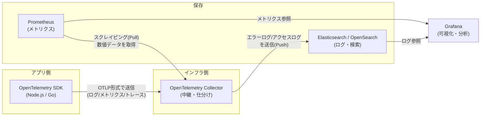
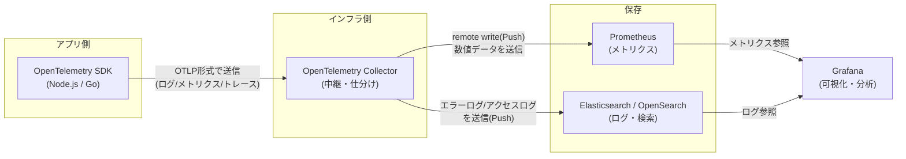
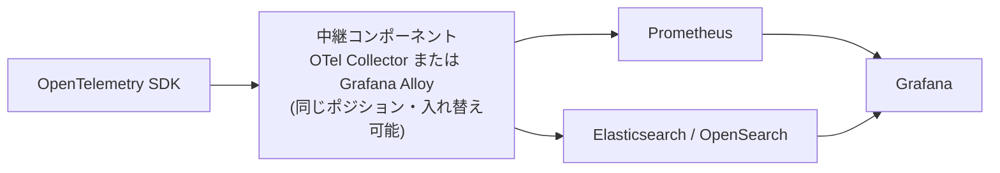

# OpenTelemetry + Grafana 監視基盤ツールリスト

| 区分 | ツール名 | 主な役割・機能 |
| --- | --- | --- |
| 計測・送信（アプリ側） | OpenTelemetry SDK（Node.js / Go用） | アプリのコードに組み込み、ログ・メトリクス・トレースを自動/手動で収集し、標準規格（OTLP形式）でCollectorへ送信する。 |
| 中継・交通整理（インフラ側） | OpenTelemetry Collector （または Grafana Alloy） | アプリから送られてきたデータを一括で受け取り、適切な保存先（PrometheusやElasticsearch）へ翻訳して仕分ける。Grafana Alloyは同じ役割を担う代替実装（→ [中継コンポーネントの選択](#中継コンポーネントの選択otel-collector--grafana-alloy)）。 |
| 保存（メトリクス） | Prometheus | システムやアプリの数値データ（CPU、メモリ、APIレスポンス時間など）を専門に蓄積する。Collectorとの連携はPull型（スクレイピング）／Push型（remote write）の2方式がある。 |
| 保存（検索・ログ） | Elasticsearch（またはOpenSearch） | ① Algoliaの代替として商品等のデータを高速検索する（本来の目的） ② Collectorから届いたアプリのエラーログやアクセスログを保存する。 |
| 可視化・分析 | Grafana | PrometheusとElasticsearchに接続し、メトリクス（グラフ）とログ（検索）を1つのダッシュボードに統合して表示する。 |

## データの流れ

メトリクスをPrometheusに取り込む方式は2通りある。ログ（Elasticsearch）は常にCollectorからのPushで、可視化はGrafanaが両者を参照する点は共通。

### パターンA：Pull型（Prometheus本来の方式 / 推奨）

Prometheusが、Collectorの公開エンドポイント（`/metrics`）から定期的にスクレイピングして取得する。構成がシンプルで、Prometheus標準の運用に乗りやすい。

### パターンB：Push型（remote write）

Collectorが `remote_write` でPrometheusへ送り込む。スクレイピングが難しい環境（短命なジョブ、ネットワーク制約など）や、メトリクスを集約・転送したい場合に向く。

## 中継コンポーネントの選択（OTel Collector / Grafana Alloy）

「中継・交通整理」の役割は、**OpenTelemetry Collector** と **Grafana Alloy** のどちらでも担える。両者は競合する別物ではなく、同じポジションに入る実装の選択肢である。

Grafana Alloyは、Grafana社が配布するOpenTelemetry Collectorのディストリビューション（独自拡張版）。旧 **Grafana Agent の後継**であり、Grafana Agentは非推奨。データの流れ（前述のPull型／Push型）はどちらを採用しても変わらず、図中の Collector が Alloy に置き換わるだけ。

### 比較

| 観点 | OpenTelemetry Collector | Grafana Alloy |
| --- | --- | --- |
| 提供元 | OpenTelemetry（CNCF） | Grafana Labs |
| 設定方法 | YAML | 独自のAlloy設定言語（コンポーネント指向、HCL風） |
| OTLP受信 | ○ | ○ |
| Prometheusスクレイピング | ○（receiver） | ○（ネイティブに得意） |
| Grafanaスタック連携 | 可能 | Loki / Mimir / Tempo / Pyroscope と親和性が高い |
| ベンダー中立性 | 高い（標準準拠） | Grafanaエコシステム寄り |

### 選択の目安

- **OTel Collector**：ベンダー中立を重視、標準OTLP中心、特定ベンダーに寄せたくない場合。
- **Grafana Alloy**：Grafanaスタック（特にLoki / Mimir / Tempo）を本格利用、Prometheusスクレイピングを多用、Grafana流の運用に揃えたい場合。

> 補足：現構成の保存先は Prometheus + Elasticsearch のため、Alloyを使う場合もそのまま両方へ書き込める。将来的にGrafanaを軸に据えるなら、ログを **Loki**、メトリクスを **Mimir** に寄せる構成も検討余地がある。
