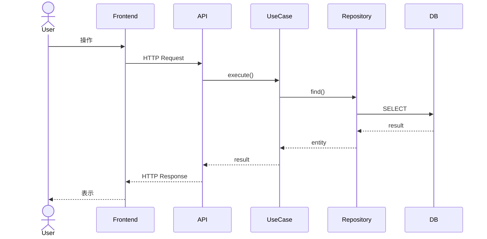

# 詳細設計書テンプレート

## 0. 文書情報

| 項目    | 内容    |
| ----- | ----- |
| システム名 |       |
| 文書名   | 詳細設計書 |
| 対象機能  |       |
| 機能ID  |       |
| バージョン | v1.0  |
| 作成者   |       |
| 作成日   |       |
| 最終更新日 |       |

---

## 1. 対象範囲

本書では、以下の機能について実装に必要な詳細仕様を定義する。

* 対象機能：
* 対象画面：
* 対象API：
* 対象バッチ：
* 対象テーブル：

---

## 2. 関連資料

| 資料名    | 内容 |
| ------ | -- |
| 要件定義書  |    |
| 基本設計書  |    |
| API仕様書 |    |
| DB定義書  |    |

---

## 3. 機能概要

### 3.1 機能の目的

この機能が実現する目的を記述する。

### 3.2 処理概要

1.
2.
3.

### 3.3 利用者・権限

| 利用者    | 利用可否 | 条件 |
| ------ | ---- | -- |
| 管理者    | ○    |    |
| 一般ユーザー |      |    |

---

## 4. 処理詳細

## 4.1 正常系処理フロー

1. リクエストを受け取る
2. 認証状態を確認する
3. 認可条件を確認する
4. 入力値を検証する
5. 対象データを取得する
6. 業務ルールを判定する
7. データを登録・更新・削除する
8. レスポンスを返却する
9. 操作ログを記録する

## 4.2 異常系処理フロー

| No | 条件          | 処理      | エラーコード | メッセージ         |
| -- | ----------- | ------- | ------ | ------------- |
| 1  | 認証されていない    | 処理を中断する | 401    | ログインしてください    |
| 2  | 権限がない       | 処理を中断する | 403    | 権限がありません      |
| 3  | 入力値が不正      | 処理を中断する | 422    | 入力内容を確認してください |
| 4  | 対象データが存在しない | 処理を中断する | 404    | データが見つかりません   |

---

## 5. 入力チェック仕様

| 項目名   | 必須 | 型      | 最大桁数 | 形式    | チェック内容   | エラー時メッセージ           |
| ----- | -- | ------ | ---- | ----- | -------- | ------------------- |
| name  | ○  | string | 255  |       | 未入力、桁数超過 | 名前を入力してください         |
| email | ○  | string | 255  | email | 形式不正     | メールアドレスの形式が正しくありません |

---

## 6. 業務ルール

| ルールID  | ルール内容 | 判定タイミング |
| ------ | ----- | ------- |
| BR-001 |       |         |
| BR-002 |       |         |

例：

| ルールID  | ルール内容            | 判定タイミング |
| ------ | ---------------- | ------- |
| BR-001 | 自分が作成したデータのみ編集可能 | 更新前     |
| BR-002 | 削除済みデータは更新不可     | 更新前     |

---

## 7. API詳細設計

## 7.1 API基本情報

| 項目           | 内容                                |
| ------------ | --------------------------------- |
| API名         |                                   |
| エンドポイント      |                                   |
| HTTPメソッド     | GET / POST / PUT / PATCH / DELETE |
| 認証           | 必須 / 不要                           |
| 認可           |                                   |
| Content-Type | application/json                  |

## 7.2 リクエスト

### Path Parameters

| 名前 | 型       | 必須 | 説明   |
| -- | ------- | -- | ---- |
| id | integer | ○  | 対象ID |

### Query Parameters

| 名前   | 型       | 必須 | 説明    |
| ---- | ------- | -- | ----- |
| page | integer |    | ページ番号 |

### Request Body

```json
{
  "name": "string",
  "email": "user@example.com"
}
```

## 7.3 レスポンス

### 正常レスポンス

HTTP Status: `200 OK`

```json
{
  "id": 1,
  "name": "string",
  "email": "user@example.com"
}
```

### 異常レスポンス

HTTP Status: `422 Unprocessable Entity`

```json
{
  "message": "入力内容を確認してください",
  "errors": {
    "email": [
      "メールアドレスの形式が正しくありません"
    ]
  }
}
```

---

## 8. DB詳細設計

## 8.1 使用テーブル

| テーブル名          | 用途           |
| -------------- | ------------ |
| users          | ユーザー情報の取得・更新 |
| operation_logs | 操作ログの記録      |

## 8.2 テーブル定義

### users

| カラム名       | 型            | NULL | KEY    | 初期値  | 説明      |
| ---------- | ------------ | ---- | ------ | ---- | ------- |
| id         | bigint       | NO   | PK     |      | ID      |
| name       | varchar(255) | NO   |        |      | 名前      |
| email      | varchar(255) | NO   | UNIQUE |      | メールアドレス |
| created_at | timestamp    | YES  |        | null | 作成日時    |
| updated_at | timestamp    | YES  |        | null | 更新日時    |

## 8.3 CRUD表

| 処理   | users | operation_logs |
| ---- | ----- | -------------- |
| 一覧取得 | R     |                |
| 詳細取得 | R     |                |
| 登録   | C     | C              |
| 更新   | U     | C              |
| 削除   | D     | C              |

---

## 9. SQL・クエリ仕様

## 9.1 データ取得条件

| 項目     | 条件 |
| ------ | -- |
| 対象テーブル |    |
| 検索条件   |    |
| 並び順    |    |
| 件数制限   |    |

## 9.2 疑似SQL

```sql
SELECT
  id,
  name,
  email
FROM
  users
WHERE
  id = :id
  AND deleted_at IS NULL;
```

---

## 10. クラス・モジュール設計

## 10.1 使用クラス一覧

| クラス名          | 役割       |
| ------------- | -------- |
| XxxController | リクエスト受付  |
| XxxUseCase    | ユースケース実行 |
| XxxService    | 業務ルール判定  |
| XxxRepository | DBアクセス   |
| XxxRequest    | 入力値検証    |
| XxxResource   | レスポンス整形  |

## 10.2 クラス詳細

### XxxController

| 項目     | 内容                                  |
| ------ | ----------------------------------- |
| 役割     | HTTPリクエストを受け取りUseCaseを呼び出す          |
| 主なメソッド | index, show, store, update, destroy |

### XxxUseCase

| 項目 | 内容              |
| -- | --------------- |
| 役割 | アプリケーション処理を制御する |
| 入力 | XxxInputDto     |
| 出力 | XxxOutputDto    |

---

## 11. シーケンス



---

## 12. 状態遷移

対象データに状態がある場合のみ記述する。

| 現在状態 | 操作  | 次状態 | 条件        |
| ---- | --- | --- | --------- |
| 下書き  | 公開  | 公開中 | 必須項目が入力済み |
| 公開中  | 非公開 | 非公開 |           |

---

## 13. ログ設計

| ログ種別  | 出力タイミング   | 出力内容                          | 保存先   |
| ----- | --------- | ----------------------------- | ----- |
| 操作ログ  | 登録・更新・削除時 | user_id, action, target_id    | DB    |
| エラーログ | 例外発生時     | error_code, message, trace_id | アプリログ |
| 監査ログ  | 重要操作時     | before, after                 | DB    |

---

## 14. 例外処理

| 例外                      | 発生条件  | HTTP Status | 処理    |
| ----------------------- | ----- | ----------- | ----- |
| AuthenticationException | 未ログイン | 401         | エラー返却 |
| AuthorizationException  | 権限なし  | 403         | エラー返却 |
| ValidationException     | 入力不正  | 422         | エラー返却 |
| ModelNotFoundException  | データなし | 404         | エラー返却 |

---

## 15. トランザクション設計

| 処理 | トランザクション | ロールバック条件      |
| -- | -------- | ------------- |
| 登録 | あり       | DB更新失敗、外部連携失敗 |
| 更新 | あり       | DB更新失敗        |
| 削除 | あり       | DB更新失敗        |

### トランザクション範囲

1. 入力値検証
2. 対象データ取得
3. 業務ルール判定
4. DB更新開始
5. 関連データ更新
6. ログ登録
7. コミット

---

## 16. 外部連携詳細

| 項目     | 内容                             |
| ------ | ------------------------------ |
| 連携先    |                                |
| 方式     | REST API / SQS / Webhook / FTP |
| タイムアウト |                                |
| リトライ   |                                |
| 失敗時処理  |                                |
| 冪等性キー  |                                |

---

## 17. セキュリティ考慮

| 観点            | 対応 |
| ------------- | -- |
| 認証            |    |
| 認可            |    |
| XSS           |    |
| CSRF          |    |
| SQL Injection |    |
| ファイルアップロード    |    |
| 個人情報マスキング     |    |
| レート制限         |    |

---

## 18. テスト観点

## 18.1 正常系

| No | テスト内容      | 期待結果  |
| -- | ---------- | ----- |
| 1  | 正しい入力で登録する | 登録される |

## 18.2 異常系

| No | テスト内容   | 期待結果          |
| -- | ------- | ------------- |
| 1  | 必須項目未入力 | バリデーションエラーになる |

## 18.3 境界値

| No | 項目   | 条件    | 期待結果 |
| -- | ---- | ----- | ---- |
| 1  | name | 255文字 | OK   |
| 2  | name | 256文字 | NG   |

---

## 19. 未決事項

| No | 内容 | 影響 | 担当 | 期限 |
| -- | -- | -- | -- | -- |
| 1  |    |    |    |    |

---

## 20. 変更履歴

| バージョン | 日付 | 変更内容 | 作成者 |
| ----- | -- | ---- | --- |
| v1.0  |    | 初版作成 |     |
